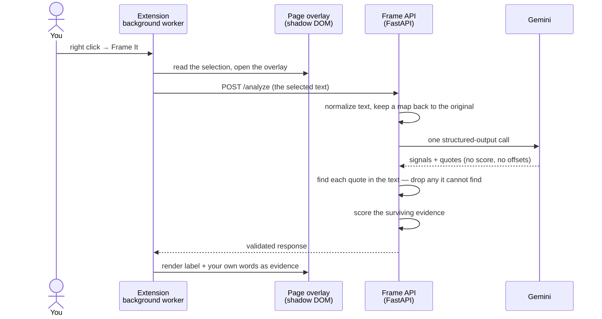

# Frame

[](https://github.com/onielrosario/frameit/actions/workflows/ci.yml)

Frame shows how a passage of text frames a U.S. political issue, and points at the exact words
that do it.

Select text on any webpage → right click → **Frame It** → a short analysis appears on the page:
a Left / Center / Right / Unclear read, and the evidence behind it.

Frame is **not** a fact checker, an author profiler, or a chatbot. It describes how the selected
text is written. It does not judge whether it is true or who wrote it.

> **Status: early development.** The pipeline works end to end, but scoring is provisional and
> nothing about accuracy has been measured yet. Treat every result as a demo, not a verdict.
> [SYSTEM-CONTEXT.md](SYSTEM-CONTEXT.md) tracks exactly where the build stands.

## The one rule

**Every piece of evidence Frame shows is copied from the text you selected.** The model's quotes are
treated as search queries; the backend finds them in your selection and displays *your* text, never
the model's wording. A quote that can't be found is thrown away, and the result is re-scored without
it. "Unclear" is a correct answer, not a failure.

The full methodology — what Frame measures, what it refuses to claim, and its known limitations — is
in [docs/methodology.md](docs/methodology.md).

---

## Run it yourself

You run your own copy with **your own Gemini API key**. Nothing in this repo calls a shared server
or a key belonging to anyone else.

### What you need

| Tool | Version | Why |
|---|---|---|
| Python | **3.12** | The API. (macOS's built-in `python3` is too old.) |
| Node | 22+ | Building the extension. On Apple Silicon, use an arm64 Node. |
| Chrome | 116+ | The extension. |
| A Gemini API key | — | Free from [Google AI Studio](https://aistudio.google.com/apikey). |

### 1. Clone and configure

```bash
git clone https://github.com/onielrosario/frameit.git frame
cd frame
cp .env.example .env
```

Open `.env` and set two values:

```dotenv
GEMINI_API_KEY=your-key-here
FRAME_ANALYSIS_MODEL=gemini-3.8-flash   # any Gemini text model your key can use
```

`.env` is gitignored. The key is read only by the API on your machine; the extension never sees it.

### 2. Start the API

```bash
cd services/api
python3.12 -m venv .venv && source .venv/bin/activate
pip install -e ".[dev]"
uvicorn app.main:app --reload --reload-dir app --port 8000 --env-file ../../.env
```

Check it: `curl localhost:8000/health` → `{"status":"ok","api_version":"0"}`.

Without a key or model, `/health` still answers and `/analyze` returns **503** — Frame never
returns a made-up result.

### 3. Build and load the extension

In a second terminal, from the repo root:

```bash
npm ci
npm run build:extension
```

In Chrome, open `chrome://extensions`, turn on **Developer mode**, click **Load unpacked**, and pick
`apps/extension/dist` (the `dist` folder, not `apps/extension`).

Select a paragraph on any page, right click, **Frame It**. Each analysis takes about 3–8 seconds.
After rebuilding, click the reload arrow on the extension card.

### Things you will run into

- **Free-tier limits.** A free Gemini key allows roughly 5 requests a minute and 20 a day per model
  (as of late 2026 — check your AI Studio rate-limit page). Frame makes one request per analysis.
- **"Frame is unavailable right now."** Gemini answered 503 (busy) or you hit a rate limit. The
  uvicorn terminal logs the exact reason on the `frame.telemetry` line.
- **Your text goes to Google.** Frame sends the selection to Gemini under *your* key and account.
  Google's terms for the free tier may allow it to use that content to improve its products; paid
  usage is treated differently. Read Google's current terms before analyzing anything private.
- **Most news reporting comes back Unclear.** That is intended: reporting a policy is not framing
  it. Try an op-ed or a campaign email to see a directional read.

---

## How it fits together

```
apps/extension/   Chrome MV3 extension · TypeScript · React · Vite   — the only client today
services/api/     Python · FastAPI · Pydantic · Gemini                — all analysis happens here
evaluation/       labeled dataset + scoring harness                   — how quality gets measured
docs/             methodology, architecture, contract, threat model, decisions (ADRs)
apps/web/         landing page — not built yet
```

What happens when you click **Frame It**:



- The extension never talks to Gemini and never sees raw model output. It sends the selection to
  your API and renders the validated response.
- The model identifies signals and quotes; the **backend** decides the label, the confidence, and
  the evidence offsets. The model never emits a score.
- Propaganda techniques are requested from the model but **not shown yet** — that stage is still to
  be built.

[SYSTEM-CONTEXT.md](SYSTEM-CONTEXT.md) is the map of the docs. The response format is defined in one
place: [docs/analysis-contract.md](docs/analysis-contract.md).

## Development

```bash
make setup     # venv + Python deps + npm ci
make api       # run the API on :8000
make extension # build the extension
make test      # every test suite
make lint      # ruff, format check, mypy, tsc
```

`make help` lists the rest. The same checks run in CI on every push and pull request
([.github/workflows/ci.yml](.github/workflows/ci.yml)).

No test calls Gemini or needs a key; model responses are replayed from recordings in
`services/api/tests/recorded/`.

This project holds its tests to one standard: **a passing test is not evidence.** A guard counts as
tested only when removing it makes its test fail. Those checks are recorded per build step in
[services/api/docs/CONTEXT.md](services/api/docs/CONTEXT.md).

## Evaluation

The harness runs, but **the dataset is empty on purpose**: labels have to be written by a person,
blind, before seeing any Frame output. How to label is in
[evaluation/dataset/GUIDELINES.md](evaluation/dataset/GUIDELINES.md); the record format is in
`evaluation/dataset/TEMPLATE.jsonl`. Commands are in [evaluation/README.md](evaluation/README.md).

## Known limitations

- **Not measured.** No accuracy figure exists yet. Scoring is a provisional, uncalibrated reading of
  the methodology.
- **Prompt injection is mitigated, not solved.** Text written to manipulate the analyzer can still
  move a result. See [docs/threat-model.md](docs/threat-model.md).
- **Selection only.** Frame sees only what you selected — not the article, the author, or the page.
- **U.S. politics, English only, 5,000 characters max.**
- **Political symmetry is monitored, not guaranteed.** Language models have known directional
  biases; the evaluation plan tests for them, and that testing has not been done yet.

The full list is in [docs/methodology.md §12](docs/methodology.md#12-known-limitations).

## Contributing

Issues and pull requests are welcome. Before changing analysis behavior, read
[docs/methodology.md](docs/methodology.md) — its rules are the product, not suggestions. Open
questions that are deliberately unresolved are listed in
[SYSTEM-CONTEXT.md §6](SYSTEM-CONTEXT.md#6-open-questions); please raise them rather than settling
one in code.

Run `make lint` and `make test` before opening a pull request; CI runs both.

Never commit a `.env`, an API key, or the extension's signing key (`*.pem`). The `.gitignore` covers
them; keep it that way. To report a security problem privately, see [SECURITY.md](SECURITY.md).

## License

[Apache License 2.0](LICENSE). Copyright 2026 Oniel Rosario.
